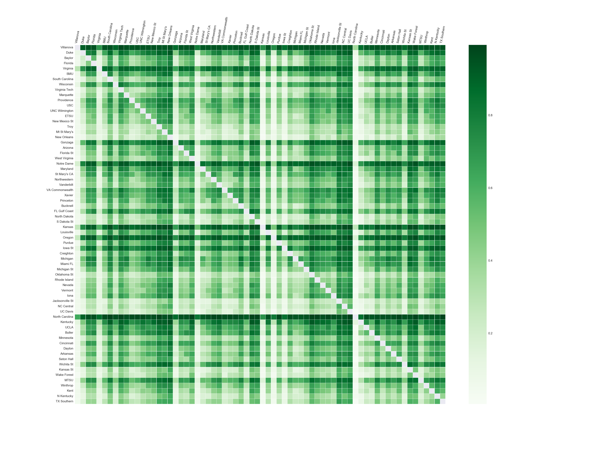

# 2017_NCAA_basketball_prediction_Kaggle
Predict 2017 NCAA basketball result

Note: This is an on-going competation. The final result will be revealed in April.

# Development environment
* Python: 2.7
* Torch: 7
* pip: sys, numpy, pandas, random, matplotlib, seaborn
* luarocks: nn, csvgo, io, optim, torch

# Data
Place the data files  [data files](https://www.kaggle.com/c/march-machine-learning-mania-2017/data) into a subfolder ./data/raw and unzip

# Algorithm design
* Processing data: neural network has great capacity of expressing data, so all the detailed features (in TourneyDetailedResults.csv and RegularSeasonDetailedResults.csv) are used to depict a team. While the teams’ preformance vary every year, only one year's perfomance can not fully decribe a team. Thus, an average is taken for counting n year's tourney matches results and m year's regular matches results. Two additional features "regular season win rate" and "tourney match number" are added for a better representation a team.
* Training model: when the training and testing data are all set, a two-layer fully connected neural network is used to train the data.
* Analysis: the result is shown in res.png, it is a heapmap with probabilities of the row teams winning the column teams. The teams are sorted by seed number, grouped by each region. We can find some intersing facts in the picture. The rows with darker colors mean these teams are stronger, we can see that they are all teams with relative small seed numbers, which is consistant with our common knowledge. The North California is most promising team according to this prediction, followed by Villanova, Kansas, Oregon, Virginia etc, which are all strong teams that preforms well in many years. In sorth region (second block), teams show less relationship with seed number than other regions, which means there is more uncertainty about the results. 

  

# Local Testing
$ python data_process.py 1 2 2018

$ th train.lua

$ python python result_analysis.py

